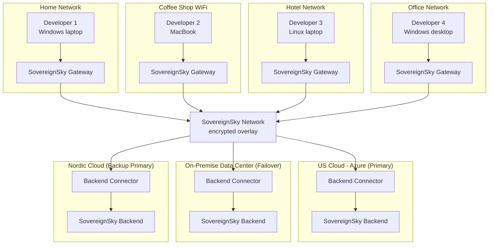

# SovereignSky Concept

**Status:** Draft

## Goal

Provide developers with **secure access to defined internal services** without exposing their machines to the organization network.

**SovereignSky** is the implementation that achieves this goal:
- Zero trust connectivity to defined internal services
- Monitoring of developer environments

SovereignSky is the **responsibility boundary** between developers and the integration team.

## Security Model

### Assumptions

**Developer machine:**
- Assumed to be infected with malware
- Private property of the developer (BYOD)
- Any OS (Windows, Mac, Linux) and CPU (x86, ARM)
- We have no control over what is installed


**Developer network:**
- The Developer machine is connected to a network that is insecure and monitored by a foreign power

### Isolation Layer

The **Isolation Layer** is a secure, isolated environment on the developer's machine. Think of it as a "clean computer within an infected computer" - malware on the host cannot reach software running inside the Isolation Layer, and vice versa.

Software running inside this environment:
- Is protected from malware on the host machine
- Is separated from other software on the machine
- Runs identically on Windows, Mac, and Linux

### SovereignSky Network

The **SovereignSky Network** is a zero trust network that runs on top of the developer's underlying network. It is:
- An encrypted overlay network
- Isolated inside the Isolation Layer - the host machine has no access
- The only path to internal services

### SovereignSky Gateway

The **SovereignSky Gateway** is the software that connects to the SovereignSky Network. It:
- Runs inside the Isolation Layer (not directly on the host)
- Provides DNS resolution for internal services
- Provides monitoring of developer environments
- Is the only component with access to the SovereignSky Network

### SovereignSky Backend

A **SovereignSky Backend** hosts internal services that developers access through the SovereignSky Network. Each backend provides services such as:
- Internal web services
- AI/LLM services
- Internal APIs

Backends can run anywhere - on-premises, in the cloud, or at a partner location. The SovereignSky Network securely connects the Gateway to one or more Backends regardless of their physical location.

Developers never access Backends directly - only through the SovereignSky Gateway.

### Backend Connector

The **Backend Connector** is the software that connects a Backend to the SovereignSky Network. It:
- Runs inside the Backend infrastructure
- Provides the secure connection point for the SovereignSky Network
- Enables the Backend to receive traffic from SovereignSky Gateways
- Is required for each Backend location

### Resilience

The SovereignSky Network supports multiple Backends for resilience. If the primary Backend becomes unavailable, the SovereignSky Gateway automatically routes traffic to an alternative Backend.

This means:
- No single point of failure
- Developers continue working even if one Backend is down
- Backends can be located in different physical locations (cloud providers/on premise) for disaster recovery

### Overview Diagram

```
┌─────────────────────────────────────────────────────────────────────────────┐
│ DEVELOPER MACHINE (infected, untrusted)                                      │
│                                                                              │
│  ┌─────────────────────────────────────────────────────────────────────────┐│
│  │ ISOLATION LAYER ("clean computer within infected computer")             ││
│  │                                                                         ││
│  │  ┌─────────────────────────────────────────────────────────────────┐   ││
│  │  │ SOVEREIGNSKY GATEWAY                                            │   ││
│  │  │                                                                 │   ││
│  │  │  • DNS resolution for internal services                         │   ││
│  │  │  • Monitoring of developer environments                         │   ││
│  │  │  • Only component with network access                           │   ││
│  │  └──────────────────────────┬──────────────────────────────────────┘   ││
│  │                             │                                          ││
│  └─────────────────────────────┼──────────────────────────────────────────┘│
│                                │                                            │
└────────────────────────────────┼────────────────────────────────────────────┘
                                 │
                    SOVEREIGNSKY NETWORK
                    (encrypted overlay network)
                                 │
              ┌──────────────────┴──────────────────┐
              │                                     │
              ▼                                     ▼
┌─────────────────────────────────────┐  ┌─────────────────────────────────────┐
│ SOVEREIGNSKY BACKEND (Primary)      │  │ SOVEREIGNSKY BACKEND (Failover)     │
│                                     │  │                                     │
│  ┌───────────────────────────────┐  │  │  ┌───────────────────────────────┐  │
│  │ BACKEND CONNECTOR             │  │  │  │ BACKEND CONNECTOR             │  │
│  │ • Connects to SovereignSky    │  │  │  │ • Connects to SovereignSky    │  │
│  │   Network                     │  │  │  │   Network                     │  │
│  └───────────────────────────────┘  │  │  └───────────────────────────────┘  │
│                                     │  │                                     │
│  Backend Services:                  │  │  Backend Services:                  │
│  • Internal web services            │  │  • Internal web services            │
│  • AI/LLM services                  │  │  • AI/LLM services                  │
│  • Internal APIs                    │  │  • Internal APIs                    │
│                                     │  │                                     │
│  Location: Cloud/On-premise         │  │  Location: Different site           │
└─────────────────────────────────────┘  └─────────────────────────────────────┘
```

### Network Diagram



This diagram shows:
- Developers connecting from different networks (home, public WiFi, hotel, office)
- Each developer has their own SovereignSky Gateway (isolated on their machine)
- All Gateways connect through the SovereignSky Network
- Multiple SovereignSky Backends in different locations, each with a Backend Connector

**Failover strategy:**
- **Primary (US Cloud - Azure):** Normal operations
- **Failover (On-Premise):** Automatic failover if Primary becomes unavailable
- **Backup Primary (Nordic Cloud):** Emergency plan - full system migration if US cloud access is permanently lost

### Key Security Benefit

If the developer's machine is infected:
- **Malware cannot reach internal services** - only the SovereignSky Gateway has network connectivity
- **Host processes have no route** to internal network addresses
- **Only software using the SovereignSky Gateway** can resolve internal service names

### Cloud Provider Independence

**The problem:** American tech giants control over 70% of Europe's cloud infrastructure. Organizations face regulatory and geopolitical risks:
- **US CLOUD Act** - US providers must hand over data to US authorities regardless of where it is stored
- **GDPR compliance** - Uncertainty about data transfers to US jurisdiction
- **Geopolitical risk** - Dependency on foreign-controlled infrastructure

**Government guidance:**
- Norwegian Minister of Digitalisation Karianne Tung has advised all organizations to have an exit strategy for US cloud providers
- The EU is developing a Cloud Sovereignty Framework with criteria for evaluating provider sovereignty
- The upcoming EU Cloud and AI Development Act aims to ensure strategic EU use cases can rely on sovereign cloud solutions

**How SovereignSky addresses this:**
- Backends can run on any cloud provider or on-premise
- The SovereignSky Gateway automatically fails over between Backends
- Organizations can migrate Backends without changing developer workflows
- No dependency on any specific cloud provider

**References:**
- [Digi.no - Tung ber alle ha exit-strategi klar](https://www.digi.no/artikler/tung-ber-alle-ha-exit-strategi-klar-i-tilfelle-google-og-microsoft-blir-ulovlig/556705)
- [EU Cloud Sovereignty Framework](https://commission.europa.eu/news-and-media/news/commission-moves-forward-cloud-sovereignty-eur-180-million-tender-2025-10-10_en)
- [EU Digital Sovereignty Strategy](https://cms-lawnow.com/en/ealerts/2025/04/the-comeback-is-on-how-the-eu-plans-to-reclaim-digital-sovereignty)
